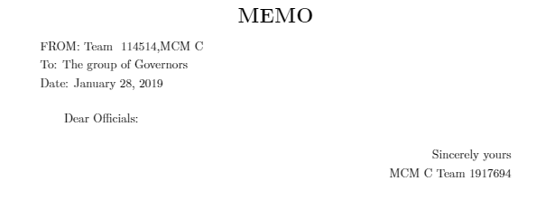
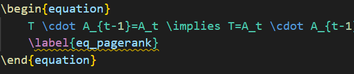
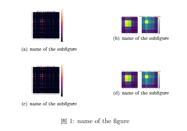
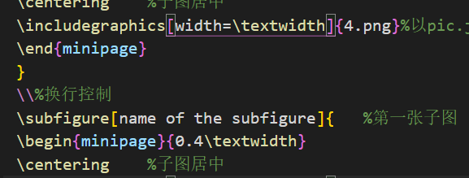
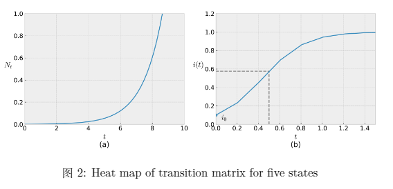
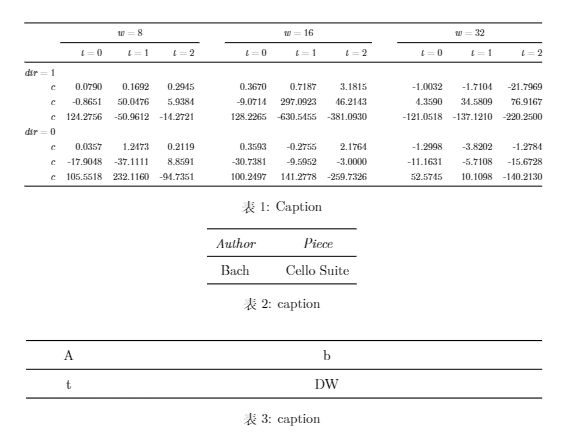
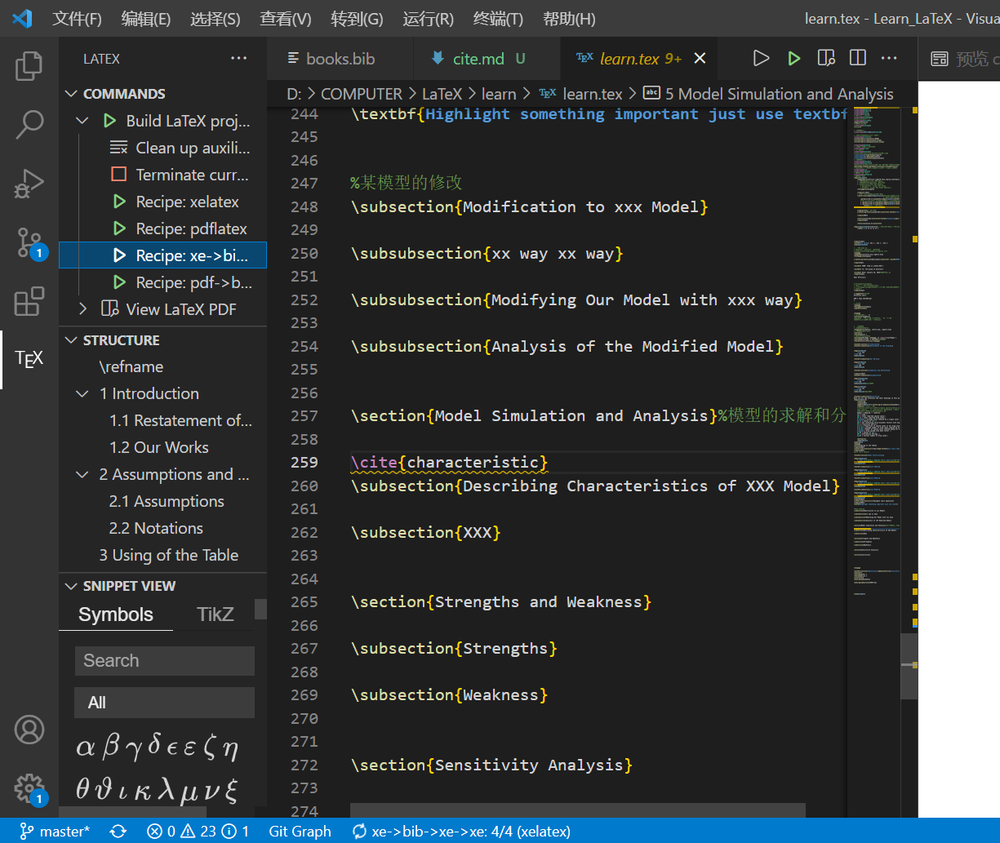

## README

图片放置在该文件目录下，参考文献放置于books.bib中，表格图片等的使用详情查看上一级文件目录中的相应板块

### 快捷的指令
    1.new command : latex 内置
    \newcommand\s[1]{\textbf{\section{#1}}}
    \newcommand\subs[1]{\textbf{\subsection{#1}}}
    \newcommand\subss[1]{\textbf{\subsubsection{#1}}
    大中小标题

    \newcommand\pic{\centerline{\textcolor{red}{picture！}}}
    缺失标题的填充

### 基本语法

    \begin{itemize}
    \item 123
    \item 234
    \end{itemize}
    创建无序列表

    \begin{enumerate}
    \item 123
    \item 234
    \end{enumerate}
    有序列表

    \vspace*{10pt}
    使用此来调节行间距

    \cite{} 
    进行文献的引用

### memo的添加：

    使用create_a_memo_...指令创建新的信件，记得切换下一个页面。

### 公式的添加：

    添加公式，不需要加$$

### 图片的添加：

    1. 子图的添加：
 使用create_subpicture添加一个包含子图的图片，效果如下：
 

    可以在subfigure之后添加\\对图片的排版进行控制，需要添加多张子图可以使用指令add_sub进行处理。

    2. 一般图片的添加：
   使用create_pic 添加单张图片，效果如下：

   
### 关于表格

使用create命令进行自动生成三种不同样式的表格，如下所示：

分别为：

    1.create_table_complex
    2.create_table_thin
    3.create_table_fat
    
### 引用文献格式说明
参考文献放在books.bib文件中，引用的时候使用\cite{名字}指令，编译过程中使用xe的四次编译。

代码块如下：

    1.引用网址
    
    @misc{characteristic,
	title = {NFLIS-Drug 2017 Annual Report},
	howpublished = {\url{https://www.nflis.deadiversion.usdoj.gov/DesktopModules/ReportDownloads/Reports/NFLIS-Drug-AR2017.pdf}}}

    其中第一个为引用的名字，在url中进行具体网址的更改

    2.引用论文

    在谷歌学术中进行相关的引用，在论文写作的过程中使用一个txt进行文件的管理操作，一个例子如下：

    @techreport{pagerank,
	number = {1999-66},
	month = {November},
	author = {Lawrence Page and Sergey Brin and Rajeev Motwani and Terry Winograd},
	note = {Previous number = SIDL-WP-1999-0120},
	title = {The PageRank Citation Ranking: Bringing Order to the Web.},
	type = {Technical Report},
	publisher = {Stanford InfoLab},
	year = {1999},
	institution = {Stanford InfoLab},
	abstract = {The importance of a Web page is an inherently subjective matter, which depends on the readers interests, knowledge and attitudes. But there is still much that can be said objectively about the relative importance of Web pages. This paper describes PageRank, a mathod for rating Web pages objectively and mechanically, effectively measuring the human interest and attention devoted to them. We compare PageRank to an idealized random Web surfer. We show how to efficiently compute PageRank for large numbers of pages. And, we show how to apply PageRank to search and to user navigation.}}

    直接放在相应的books.bib文件即可
    
