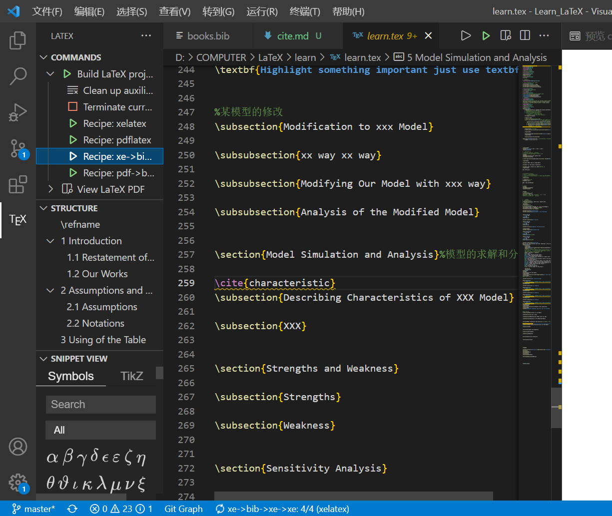

### 引用文献格式说明
参考文献放在books.bib文件中，引用的时候使用\cite{名字}指令，编译过程中使用xe的四次编译。

代码块如下：

    1.引用网址
    
    @misc{characteristic,
	title = {NFLIS-Drug 2017 Annual Report},
	howpublished = {\url{https://www.nflis.deadiversion.usdoj.gov/DesktopModules/ReportDownloads/Reports/NFLIS-Drug-AR2017.pdf}}}

    其中第一个为引用的名字，在url中进行具体网址的更改

    2.引用论文

    在谷歌学术中进行相关的引用，在论文写作的过程中使用一个txt进行文件的管理操作，一个例子如下：

    @techreport{pagerank,
	number = {1999-66},
	month = {November},
	author = {Lawrence Page and Sergey Brin and Rajeev Motwani and Terry Winograd},
	note = {Previous number = SIDL-WP-1999-0120},
	title = {The PageRank Citation Ranking: Bringing Order to the Web.},
	type = {Technical Report},
	publisher = {Stanford InfoLab},
	year = {1999},
	institution = {Stanford InfoLab},
	abstract = {The importance of a Web page is an inherently subjective matter, which depends on the readers interests, knowledge and attitudes. But there is still much that can be said objectively about the relative importance of Web pages. This paper describes PageRank, a mathod for rating Web pages objectively and mechanically, effectively measuring the human interest and attention devoted to them. We compare PageRank to an idealized random Web surfer. We show how to efficiently compute PageRank for large numbers of pages. And, we show how to apply PageRank to search and to user navigation.}}

    直接放在相应的books.bib文件即可
    